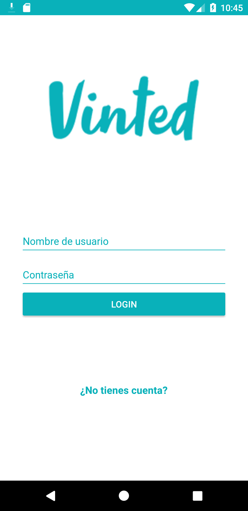
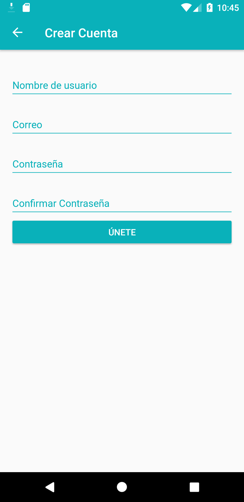
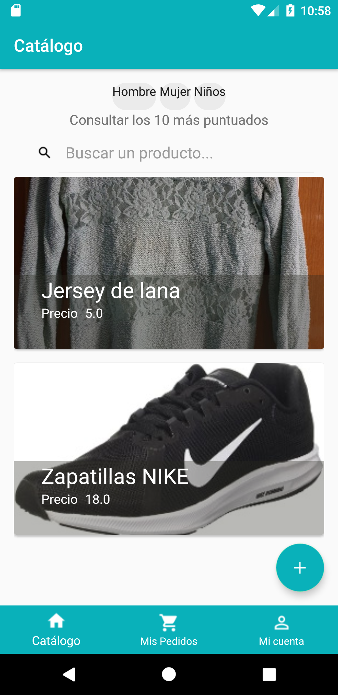
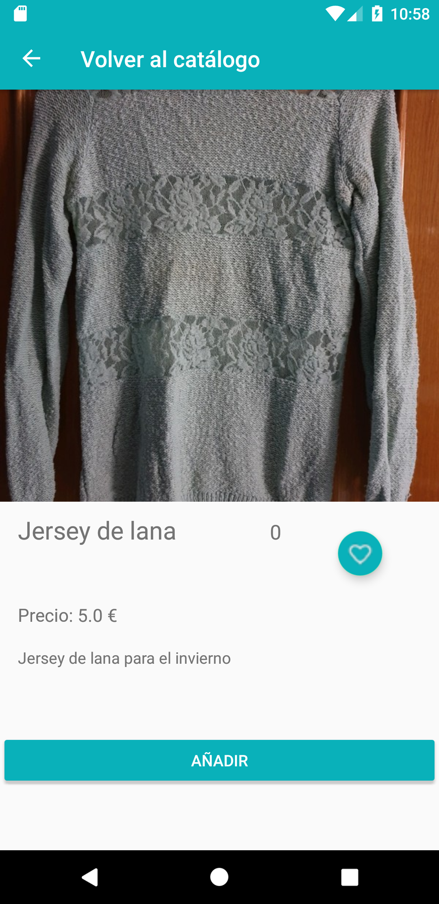
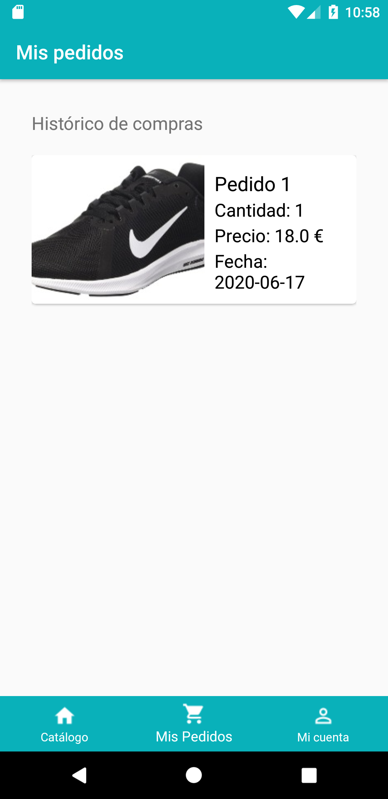
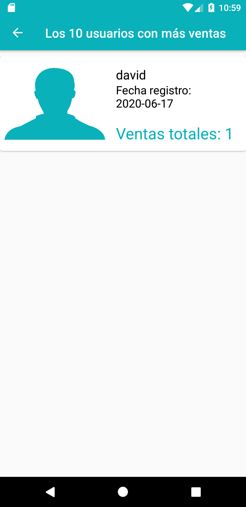
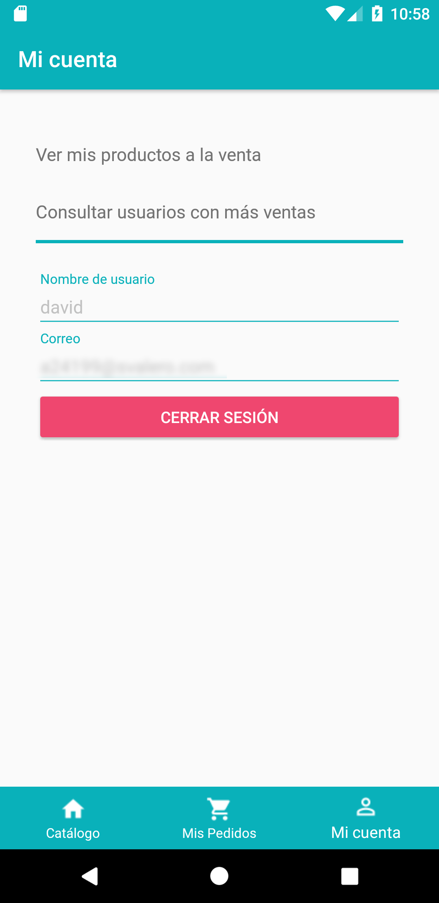

## Vinted Clone Android App
Vinted Clone Android App made in Kotlin with MVVM and Data Binding on Android Studio during classwork project. 
Libraries used: Retrofit, Butterknife and Picasso among others.

#### Backend .NET Core 3.1 WebApi
API Rest made with C# .NET WebApi on Visual Studio 2019.
* Works with Entity Framework.
* SQL Server Express Database.

#### Screenshots
<table>
  <tr>
    <td>Login</td>
    <td>Register</td>
    <td>Main</td>
    <td>Product Info</td>
  </tr>
  <tr>
    <td></td>
    <td></td>
    <td></td>
    <td></td>
  </tr>
 </table>

 <table>
  <tr>
    <td>Purchases</td>
    <td>Most sellers</td>
    <td>Account Info</td>
  </tr>
  <tr>
    <td></td>
    <td></td>
    <td></td>
  </tr>
 </table>